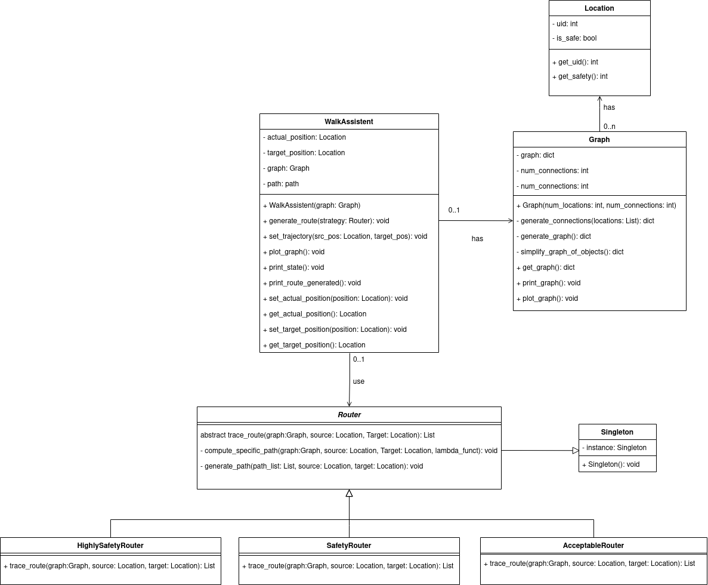

# Repositório de trabalho do MBA Machine Learning Production

Esse repositório tem por objetivo armazenar atividades desenvolvidas durante os estudos do MBA Machine Learning Production.

## 1 - ESBD2 Entregável 1

Atividade a ser entregue até a data de 15-04-2023, referente ao tema Design Patterns e os padrões Singleton e Strategy.

### **1.1 - Descrição do problema**

Suponha um sistema de geração de rotas seguras. O App deve gerar uma rota que se classifica em “altamente segura”, “segura” e “aceitável”. Como a rota deve/pode ser alterada à medida que o pedestre caminha, o sistema deve ser capaz de trocar o nível
de segurança da rota em tempo de execução. Assim, ora a rota se caracteriza como “altamente segura”, ora como “segura” e ora como “aceitável”.

- Elabore um projeto que reflita essa dinamicidade do sistema.
- Como a memória do dispositivo é limitada, deve-se cuidar para que não haja sobrecarga de objetos desnecessários em memória.

Forma de resolução:

- Diagrama de classe UML.
- Trechos de código (pseudo-código) das partes importantes.

### **1.2 - Análise do problema**

O problema de geração de rotas apresentado acima pressupõe a existência de localizações com conexões entre elas. Para esses tipos de problema é comum utilizar-se de modelagem em grafos. Vértices podem ser modelados localidades específicas e arestas seriam conexões entre 2 localizações. Como o problema trabalha com rota de pedestres é plausível considerar que as conexões são bidirecionais.

Na implementação de uma simulação para o problema e sua solução, levantou-se a hipótese das seguintes entidades:

- A classe **Graph** inserida no módulo graph_generator.py para representar uma rede de localizações com conexões entre si.

- A classe  **Location** inserida do módulo graph_generator.py. Ela é composta pelos atributos uid e is_safe, representando o id de uma localidade e se ela é segua ou não.

- A classe **WalkAssistent**,inserida no módulo **walk_assistent.py**. Entre suas atribuições está guardar posições atual e desejada, e traçar uma rota que liga as posições conforme diferentes estratégias. A forma como essas estratégias são implementadas, afim de atender ao requisito de dinamicidade do sistema, é com o emprego do padrão de projeto strategy. Esse padrão tem por finalidade aplicar diferentes estratégias para implementar determinada funcionalidade e essas estratégias são implementadas fora da classe.

- A classe abstrata **Router**. estão implementadas no módulo **router.py** e suas sub-classes concretas **HighlySafetyRouter**, **SafetyRouter** e **AcceptableRouter** para suportar a implementação de diferentes estratégias implementadas no método **trace_route**.

- Para atender ao requisito de não sobrecarregar a memória com objetos desnecessários, foi analisado no problema que objetos que correm o risco de serem instanciados várias vezes tem maior probabilidade de vir das classes que definem estratégia. Dessa forma elas foram definidas como singleton a classe **Router** e consequentemente suas subclasses **HighlySafetyRouter**, **SafetyRouter** e **AcceptableRouter**.

### **1.3 - Estratégias de geração de rota “altamente segura”, “segura” e “aceitável”**

Como não foi definido o que distingui essas 3 classificações de rota, foi necessário que se estipulasse estratégias que se encaixassem nos termos e pudessem ser implementadas com os recursos disponíveis. Dessa forma foram definidas as seguintes estratégias:

- **Rota Altamente Segura**: Uma rota altamente segura remete a um caminho entre a origem e o destino, onde todos os nós 
estão marcados como não seguros (atributo is_safe marcado como True).

- **Rota Segura**: A rota segura aqui considera algum nível de imprecisão na aferição de se um ponto é seguro ou não. Na implementação foi considerada a seguinte lógica. Na busca por um caminho, tem a probabilidade de 70% de o roteador analisar aquele ponto. Caso o ponto seja analisado, serão considerados validos apenas caminhos seguros. Caso não seja analisado, o caminho pode ser roteado sendo seguro ou inseguro.

- **Rota Aceitável**: Implementa a mesma lógica da rota segura. Porém a chance de verificar a segurança de uma localização no momento que o gerador de rotas está traçando uma rota é de 40%.

### **1.4 - Diagrama UML**

Segue abaixo uma ilustração do diagrama UML desse conjunto de classes implementado:

### **1.5 - Implementação**

Para executar esse conjunto de classes é preciso executar o seguinte conjunto de instruções:

    Navege para o diretório esbd2_entregavel_1.
    Execute o comando pip install -r requirements.txt ou similar para instalar as dependencias necessárias.
    Execute o script main.py

Antes de executar o script main.py, o usuário pode alterar o número de localizações e conexões que comporão o grafo de localizações gerado.

O script main.py realiza os seguintes passos:

- Instancia-se 3 objetos de instância única (singleton) que representam cada um uma estratégia diferente.
- Instancia-se um objeto grafo para ser utilizado como mapa de localizações e rotas para o assistente de caminhada.
- Do objeto grafo gerado se escolhe aleatóriamente 2 localizações para serem utilizadas como posições origem e destino.
- Instancia-se um objeto WalkAssistent passando para o construtor um objeto grafo.
- Valores para posição de origem e destino são passados para o objeto criado da classe WalkAssistent.
- Printa-se as posições de origem e destino desejadas para se traçar uma rota.
- Para as posições de origem e destino são geradas rotas seguindo estratégias definidas nas classes da classe abstrata Router (HighlySafetyRouter, SafetyRouter e AcceptableRouter).
- As rotas traçadas são printadas.
- É plotado o grafo de localizações e conexões usando a biblioteca matplotlib.

As implementações das classes podem ser vistas em:

- Classe Graph e classe Location: arquivo esbd2_entregavel_1/graph_generator.py
- Classe WalkAssistent: arquivo esbd2_entregavel_1/walk_assistent.py
- Classes Singleton, Router, HiglySafetyRouter, SafetyRouter e AcceptableRouter: arquivo esbd2_entregavel_1/router.py

### **1.6 - Conclusão**

No trabalho feito foi possível observar na prática as situações de uso e benefícios de utilizar os padrões Strategy e Singleton. Também foi possível exercitar a confecção de diagramas UML e implementação em python para situação proposta no exercício, agregando bastante conhecimento para o tema.